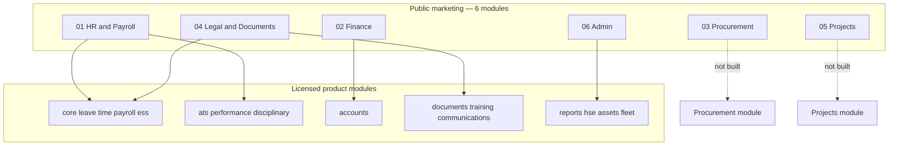

# Stride — Module Roadmap (Marketing vs Product)

**Purpose:** Align the public marketing story (`CORE_MODULES`, pricing tiers, industry verticals) with what is actually built in `hris-demo/`, and sequence the work to close gaps without over-promising.

**Last updated:** June 2026  
**Related:** [`stride-cursor-brief.md`](./stride-cursor-brief.md), [`stride-cursor-pivot-plan.md`](./stride-cursor-pivot-plan.md), [`fleet-module-spec.md`](./fleet-module-spec.md), [`../PRODUCT-MASTER-PLAN.md`](../PRODUCT-MASTER-PLAN.md)

---

## Executive summary

| Question | Answer |
|----------|--------|
| **Is Core HR “done”?** | **Mostly — not settled.** People, leave, time, payroll, ESS, recruitment, onboarding, credentials, and disciplinary are production-grade. Performance is still mock data. M-Pesa disbursement is marketed but not built (bank export only). |
| **Are all six advertised core modules built?** | **No.** Only **HR & Payroll** and **Finance** are substantially real. **Procurement**, **Projects**, and parts of **Legal** and **Admin** are vision/copy, not product modules yet. |
| **Is Logistics “available” as advertised?** | **Yes — first vertical pack.** Fleet & Logistics (Phase 3) is built: trips, compliance, settlements, billing, incidents, vehicles. Fuel/maintenance logs and driver/partner registers are partial. |
| **What should we sell today?** | HR + Payroll + ESS + Recruitment + Finance (AP/AR) + Fleet (logistics clients). Do **not** lead demos with Procurement, Projects, or board resolutions until Phase B/C below. |

---

## 1. How marketing maps to the codebase

The public site sells **six horizontal modules** (`CORE_MODULES` in `src/lib/marketing-config.ts`). The product implements **sixteen licensed modules** (`src/lib/modules.ts`). They are not 1:1.

---

## 2. Module-by-module status (advertised vs built)

Legend: **Ship** = demo/sell today · **Partial** = exists but incomplete or buried in another module · **Vision** = marketed, not built · **Mock** = UI only, no persistence

### 01 — HR & Payroll (`CORE_MODULES[0]`)

| Capability (as advertised) | Status | Product home |
|-----------------------------|--------|--------------|
| Employee directory & org | **Ship** | `core` — employees, departments, org chart |
| Leave & approvals | **Ship** | `leave` — policies, balances, ESS approvals |
| Time & attendance | **Ship** | `time` — rota, attendance, biometrics |
| Payroll (KE/UG statutory) | **Ship** | `payroll` — runs, payslips, statutory exports |
| KRA / NSSF / SHIF | **Ship** | Statutory engine + filing workflow |
| M-Pesa disbursements | **Vision** | Marketed in FAQ/pricing; **bank export only** today |
| Onboarding | **Ship** | `core` — templates, tasks, hire from ATS |
| Employee self-service | **Ship** | `ess` — PWA portal |
| Recruitment | **Ship** (not in 6-pack card) | `ats` — careers, pipeline, interviews |
| Performance | **Mock** | `performance` — demo KPI page, no DB model |
| Disciplinary & grievance | **Ship** | `disciplinary` |
| Training & development | **Partial** | `training` — programs exist; not in marketing 6-pack |

**Verdict:** Core HR is the **strongest wedge** — ~85% of what we claim. Close gaps: **M-Pesa disbursement**, **real performance management**, polish leave admin routing.

---

### 02 — Finance (`CORE_MODULES[1]`)

| Capability (as advertised) | Status | Product home |
|-----------------------------|--------|--------------|
| Accounts / ledger views | **Ship** | `accounts` — overview hub |
| Invoicing (AR) | **Ship** | Clients, invoices, credit notes, PDFs |
| Receipts & allocations | **Ship** | Client payments → invoices |
| Vendor management | **Partial** | Vendors under Finance, not Procurement |
| Vendor bills (AP) | **Ship** | Lines, VAT, payment allocation |
| Expense claims | **Ship** | Submit & approve |
| Budgets | **Partial** | Departmental budgets; not tied to projects |
| Petty cash | **Ship** | Float management |
| Financial reports | **Ship** | P&L-style views |
| M-Pesa disbursements | **Vision** | Same gap as payroll |
| Statements / ageing | **Partial** | Route exists; **placeholder** UI |

**Verdict:** Finance is **sellable** for AR/AP and outsourcer billing. Finish **statements**, **M-Pesa reconciliation**, recurring billing automation.

---

### 03 — Procurement (`CORE_MODULES[2]`)

| Capability (as advertised) | Status | Product home |
|-----------------------------|--------|--------------|
| Purchase requests | **Vision** | — |
| Approval workflows | **Partial** | Expense/leave approvals only |
| LPO generation | **Vision** | — |
| Vendor management | **Partial** | Finance vendors only |
| Spend tracking | **Partial** | Vendor bills; no PR → PO → GRN chain |

**Verdict:** **Not built.** Marketing must stay honest: “Finance covers vendors and AP today; full procurement workflow on the roadmap.” Do not show Procurement as live in demos.

---

### 04 — Legal & Documents (`CORE_MODULES[3]`)

| Capability (as advertised) | Status | Product home |
|-----------------------------|--------|--------------|
| Company policies & SOPs | **Ship** | `documents` — company documents |
| Contract register | **Partial** | People/contracts + accounts contracts; renewal reminders |
| Compliance tracking | **Partial** | `credentials` — licence expiry; not legal obligations register |
| Document workflows | **Partial** | ESS document requests; no full legal workflow |
| Renewal alerts | **Partial** | Contracts + credentials crons |

**Verdict:** **Partial.** Enough for HR compliance demos; not a unified “Legal” product surface. Needs obligation register, template library, and board-ready compliance pack.

---

### 05 — Projects (`CORE_MODULES[4]`)

| Capability (as advertised) | Status | Product home |
|-----------------------------|--------|--------------|
| Projects / workstreams | **Vision** | — |
| Tasks & deliverables | **Vision** | Onboarding tasks only (HR context) |
| Budget vs execution | **Vision** | Account budgets mention “project” in copy only |
| Team assignment | **Vision** | — |

**Verdict:** **Not built.** Highest gap vs homepage hero copy. Either build (Phase C) or soften marketing language until Phase C ships.

---

### 06 — Admin (`CORE_MODULES[5]`)

| Capability (as advertised) | Status | Product home |
|-----------------------------|--------|--------------|
| Asset registers | **Ship** | `assets` — registry, assignments |
| Fleet | **Ship** | `fleet` — full logistics vertical |
| Facilities | **Vision** | — |
| Board resolutions | **Vision** | — |

**Verdict:** **Partial.** Assets + Fleet are real (Fleet is the logistics vertical). Facilities and governance (board resolutions) are not built.

---

## 3. Industry verticals (marketing vs product)

| Vertical | Marketing status | Product status | Notes |
|----------|------------------|----------------|-------|
| **Logistics & Cargo** | Available | **Ship** | Fleet module + SwiftFreight demo pack |
| **SACCOs** | Coming soon | **Partial** | Nyati demo pack; no BOSA/FOSA/dividends/member ledger |
| **Healthcare** | Coming soon | **Partial** | Rota + biometrics exist; no clinical licence/NHIF pack |
| **Oil & Gas / Energy** | Coming soon | **Partial** | HSE UI is **mock**; fleet incidents cover ops safety only |
| **Construction** | Coming soon | **Vision** | No site/project/plant module |

---

## 4. Pricing tier honesty

| Tier | Marketing claim | Product reality today |
|------|-----------------|---------------------|
| **Starter** | 2 core modules | Enforce via `DEPLOYMENT_TIER` + module flags — **implemented** |
| **Growth** | 4 core modules + company setup | Company setup tier gate — **implemented** |
| **Enterprise** | All six modules | **Only 2–3 of six are fully built** — tier is commercial, not feature-complete |

**Recommendation:** Map tiers to **licensed product modules** (`MODULE_*`), not marketing labels, until Procurement and Projects exist:

| Tier | Suggested module bundle (env) |
|------|-------------------------------|
| Starter | `core`, `leave`, `payroll`, `ess` |
| Growth | Starter + `time`, `accounts`, `ats`, `reports` |
| Enterprise | All licensed modules + `fleet` + multi-entity |

---

## 5. Recommended build phases (Stride-aligned)

Phases are ordered by **marketing promise**, **revenue**, and **dependencies**.

### Phase A — “Core HR settled” (4–6 weeks)

*Goal: Honestly claim “HR & Payroll” as complete.*

| # | Workstream | Deliverables | Unblocks |
|---|------------|--------------|----------|
| A1 | **M-Pesa disbursement v1** | `PayrollDisbursementProvider`, bulk transfer API integration, payment status per employee | Finance + HR marketing claims |
| A2 | **Performance management** | Prisma models, cycles, ESS self-assessment, remove mock KPI page | HR completeness |
| A3 | **Leave admin unify** | Single leave hub; fix staff vs employee routing | Ops polish |
| A4 | **Payroll run wizard** | Validate → approve → export/disburse flow | Enterprise sales |
| A5 | **Marketing copy audit** | Mark Procurement/Projects as “Roadmap” on `/platform` if not built | Trust |

**Exit criteria:** Demo with `DEMO_MODE=false` shows no mock pages on primary HR paths; M-Pesa story is demonstrable (sandbox).

---

### Phase B — “Finance & Legal credible” (4–6 weeks)

*Goal: Deliver modules 02 and 04 to a sellable standard.*

| # | Workstream | Deliverables |
|---|------------|--------------|
| B1 | **Accounts statements** | Replace placeholder; debtor/creditor ageing, PDF email |
| B2 | **Billing automation** | Recurring invoices, payroll → invoice draft for outsourcers |
| B3 | **Legal surface** | Unified “Legal & compliance” nav: contracts + credentials + company docs |
| B4 | **Obligation register** | Renewal dates, owners, alerts (extends contracts/credentials) |
| B5 | **M-Pesa reconciliation** | Match disbursements to payroll run |

**Exit criteria:** Finance module demo matches marketing card; Legal is one coherent area, not three scattered routes.

---

### Phase C — “Procurement” (6–8 weeks)

*Goal: Build marketing module 03.*

| # | Workstream | Deliverables |
|---|------------|--------------|
| C1 | **Data model** | `PurchaseRequest`, `PurchaseOrder` (LPO), `GoodsReceipt`, approval chain |
| C2 | **Workflow** | Request → approve → LPO PDF → vendor bill link |
| C3 | **Spend dashboard** | By department, vendor, budget line |
| C4 | **Module licensing** | `MODULE_PROCUREMENT`, nav, route guards |
| C5 | **ESS** | Optional: staff can submit PR from mobile |

**Exit criteria:** End-to-end PR → LPO → vendor bill without leaving Stride.

---

### Phase D — “Projects” (6–10 weeks)

*Goal: Build marketing module 05.*

| # | Workstream | Deliverables |
|---|------------|--------------|
| D1 | **Data model** | `Project`, `Milestone`, `ProjectTask`, time/cost allocation |
| D2 | **Budget link** | Tie to `accounts` budgets; actuals from payroll + AP + expenses |
| D3 | **Dashboard** | Project board, burn rate, deliverable status |
| D4 | **Construction vertical seed** | Site/project template (feeds “coming soon” → available) |

**Exit criteria:** “Projects” card on homepage is truthful for at least one pilot client.

---

### Phase E — “Admin completion” (4–6 weeks)

*Goal: Finish marketing module 06 beyond assets + fleet.*

| # | Workstream | Deliverables |
|---|------------|--------------|
| E1 | **Facilities** | Sites/locations, leases, maintenance tickets (light CMMS) |
| E2 | **Board & governance** | Resolution register, meeting minutes, action tracking |
| E3 | **Fleet polish** | Fuel/maintenance logs, driver/partner registers per spec gaps |
| E4 | **Fleet ESS** | Driver trip updates + POD capture on mobile |

---

### Phase F — Industry vertical packs (parallel tracks)

| Vertical | Depends on | MVP scope |
|----------|------------|-----------|
| **SACCOs** | Phase A payroll | Member ledger, BOSA/FOSA splits, dividend run, SASRA report templates |
| **Healthcare** | Phase A time | Clinical rota rules, licence gate on shifts, NHIF reporting hooks |
| **Energy** | Phase E + real HSE | Replace mock HSE; permit tracking; multi-entity HSE rollup |
| **Construction** | Phase D projects | Site hierarchy, plant assets, subcontractor AP |

---

## 6. What to demo vs what to defer (sales guide)

### Safe to demo today

- Overview, employees, departments, org chart  
- Leave, rota, attendance, biometrics  
- Payroll run, payslips, statutory exports  
- ESS (leave, payslips, attendance)  
- Recruitment (careers → hire → onboarding)  
- Finance: invoices, vendors, vendor bills, expenses, budgets  
- Assets  
- **Fleet & Logistics** (SwiftFreight / cargo demo pack)  
- Company documents, contracts, credentials  

### Show only with caveats

- Performance (mock — say “beta”)  
- HSE general module (mock — use Fleet incidents for logistics)  
- Accounts statements (placeholder)  
- M-Pesa (bank file today; API “on roadmap” unless Phase A done)  

### Do not demo as live

- Procurement / LPO / purchase requests  
- Projects / deliverables / project budgets  
- Facilities management  
- Board resolutions  
- SACCO dividends / BOSA-FOSA (unless custom build)  

---

## 7. Marketing site adjustments (until Phase C/D ship)

Short-term copy changes to stay truthful without shrinking ambition:

1. **`MarketingHero` / `/platform`** — Add qualifier: “HR & Finance live today; Procurement and Projects rolling out on the roadmap.”
2. **`CORE_MODULES` cards** — Badge: `Live` | `Partial` | `Coming soon` per module (Logistics vertical already uses this pattern).
3. **FAQ** — Already says teams start with HR + Finance; keep emphasising that.
4. **Enterprise tier** — “All six modules” → “Full platform roadmap + priority vertical packs” until Phase C/D exit.

---

## 8. Document maintenance

| When | Update |
|------|--------|
| A module reaches **Ship** in §2 | Change status + demo guide §6 |
| A vertical MVP ships | Change `INDUSTRY_VERTICALS[].status` in `marketing-config.ts` |
| Phase completes | Tick exit criteria; sync `PRODUCT-MASTER-PLAN.md` §3 snapshot |

---

## 9. Quick answer for stakeholders

> **Have we settled Core HR?**  
> **Almost.** It is the most complete part of the platform and safe to sell. Payroll compliance, leave, time, recruitment, and ESS are real. Performance and M-Pesa disbursement are the main gaps before we call HR “done.”

> **Have we built what the website advertises?**  
> **Two of six core modules are strong (HR, Finance); one vertical (Logistics) is live; four modules and four verticals are partial or roadmap.** The website correctly describes the **vision**; the **product** is ahead on HR/Finance/Fleet and behind on Procurement, Projects, and Admin extras.

> **What next?**  
> **Phase A** (settle HR) → **Phase B** (Finance/Legal credible) → **Phase C/D** (Procurement + Projects to match homepage) → **Phase F** (vertical packs).
